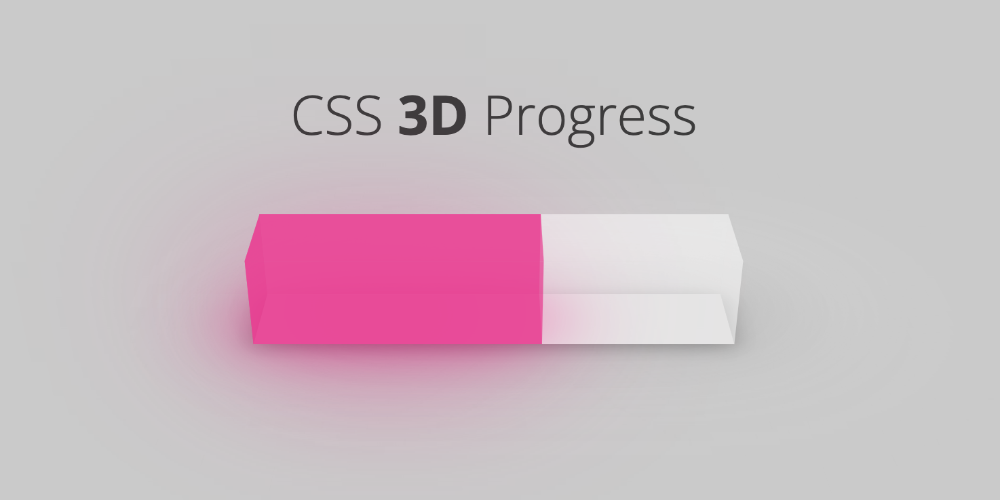

A 3D progress bar component written using web Components, supports Vue, React and Svelte.

## Install

```bash
npm install css-3d-progress
```

## Usage

### Web Components

```html
<!DOCTYPE html>
<html lang="en">
  <head>
    <meta charset="UTF-8" />
    <title>css-3d-progress</title>
    <meta name="viewport" content="width=device-width, initial-scale=1.0" />
    <script defer src="https://unpkg.com/css-3d-progress@0.0.3/css-3d-progress.js"></script>
    <style>
      body {
        margin: 0;
        height: 100vh;
        display: grid;
        place-items: center;
        background-color: #d0d0d0;
      }
    </style>
  </head>
  <body>
    <div style="width: 20em">
      <css-3d-progress percent="60"></css-3d-progress>
    </div>
  </body>
</html>
```

### Vue

```vue
<script setup>
import "css-3d-progress";
import { ref } from "vue";

const percent = ref(60);
</script>

<template>
  <div style="width: 20em">
    <css-3d-progress :percent="percent"></css-3d-progress>
  </div>
</template>
```

### React

```jsx
import "css-3d-progress";
import { useState } from "react";

function App() {
  const [percent] = useState(60);
  const style = { width: "20em" };

  return (
    <>
      <div style={style}>
        <css-3d-progress percent={percent}></css-3d-progress>
      </div>
    </>
  );
}

export default App;
```

### Svelte

```svelte
<script>
  import "css-3d-progress";

  const percent = 60;
</script>

<main>
  <div style="width: 20em;">
    <css-3d-progress {percent}></css-3d-progress>
  </div>
</main>
```


## Options

| Name          | Type   | Default                      | Description                      |
| ------------- | ------ | ---------------------------- | -------------------------------- |
| percent       | string | 0                            | To set the completion percentage |
| is-animation  | string | false                        | Whether to enable flow effects   |
| stroke-color  | string | \#ec008c99                   | The color of progress bar        |
| trail-color   | string | \#fefefe4d                   | The color of unfilled part       |
| back-shadow   | string | -0.5em -1.5em 4em \#ec008ccc | Box-shadow on back               |
| bottom-shadow | string | 0em 0em 2em \#ec008ccc       | Box-shadow on bottom             |

## License

[MIT](LICENSE)
